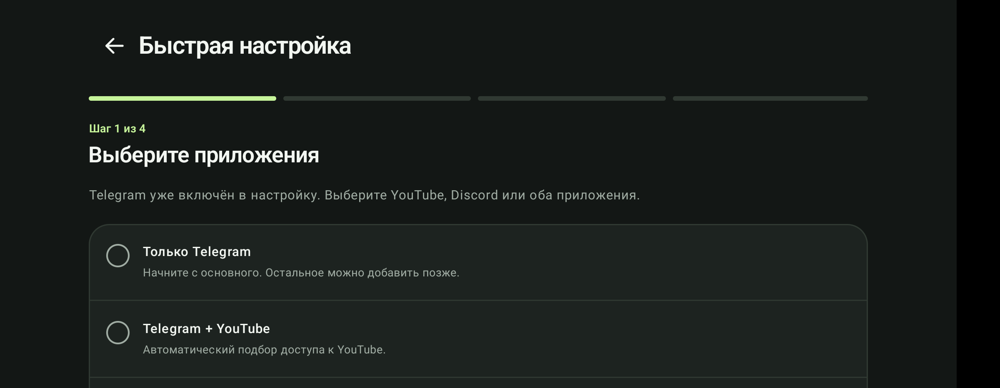
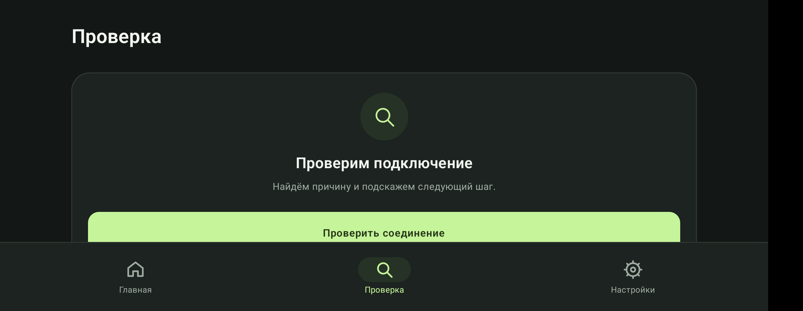
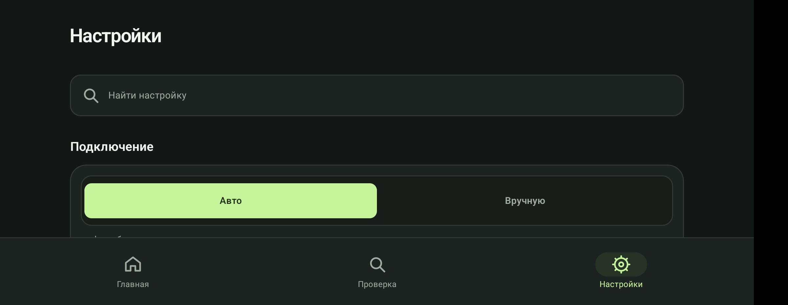
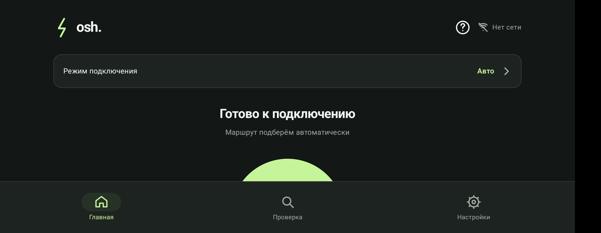

<h1 align="center">osh.</h1>

<strong>Telegram, YouTube and Discord without babysitting routes and proxy profiles.</strong>

  <a href="README.md">Русский</a> · <strong>English</strong>

  <a href="https://github.com/grudametalla/osh./releases"><strong>Download</strong></a> ·
  <a href="FEATURES_EN.md">Features</a> ·
  <a href="INSTALL_EN.md">Installation</a> ·
  <a href="SECURITY_EN.md">Security</a> ·
  <a href="PRIVACY_EN.md">Privacy</a>

> **Public Beta.** osh. is currently in public beta. Service availability depends on the Android version, carrier, network and restrictions currently applied to that network.

## What is osh.

osh. helps keep Telegram, YouTube and Discord reachable on Android.

- **Telegram** uses a local bridge running on the device.
- **YouTube and Discord** use Smart Access: one Android VPN for selected applications with automatic route selection.
- **Everything else** continues to use the normal Internet connection and is not routed through osh.

osh. is not an anonymity VPN service and cannot guarantee third-party service availability on every network.

## Interface

| Quick setup | Connection check |
| :--: | :--: |
|  |  |
| **Settings** | **Home** |
|  |  |

## Highlights

- Local Telegram Bridge.
- Smart Access for YouTube and Discord.
- YouTube and Discord can share a single Android VPN.
- Automatic and manual connection modes.
- Recovery after Wi-Fi/LTE changes and temporary network failures.
- Built-in connection diagnostics.
- Optional autostart and Android Quick Settings tile.
- Updates from the official GitHub Release channel with APK signature verification.
- Local settings and diagnostics with no built-in advertising analytics.

See [FEATURES_EN.md](FEATURES_EN.md) for details.

## Installation

1. Open [Releases](https://github.com/grudametalla/osh./releases).
2. On a typical ARM64 Android phone, download `osh-<version>-arm64-v8a.apk`.
3. Use `osh-<version>-universal.apk` when a universal package is required.
4. Install the APK and complete the quick setup.
5. Follow [INSTALL_EN.md](INSTALL_EN.md) to verify SHA-256 checksums and the signing certificate.

Minimum supported version: **Android 8.0 (API 26)**.

## Release security

Official APKs are published only in this repository's **Releases** section and are signed with the permanent osh. production certificate.

Certificate SHA-256 fingerprint:

`a5327cd2a2c0c48e6805467ae22cc5db83a7fd54c84715d1cc9dc94c5f6c0c9c`

Every release also includes checksums and release metadata. Verification steps are documented in [INSTALL_EN.md](INSTALL_EN.md).

## Support

For regular bugs and installation questions, use [Issues](https://github.com/grudametalla/osh./issues). Include the osh. version, Android version, network type and a short description.

Do not post tokens, passwords, message contents or private diagnostic reports. Report security issues using [SECURITY_EN.md](SECURITY_EN.md).

## Licensing

osh. is proprietary software. This repository is the official distribution point for APKs, user documentation and release verification information.

Third-party notices: [THIRD_PARTY_NOTICES_EN.md](THIRD_PARTY_NOTICES_EN.md).
