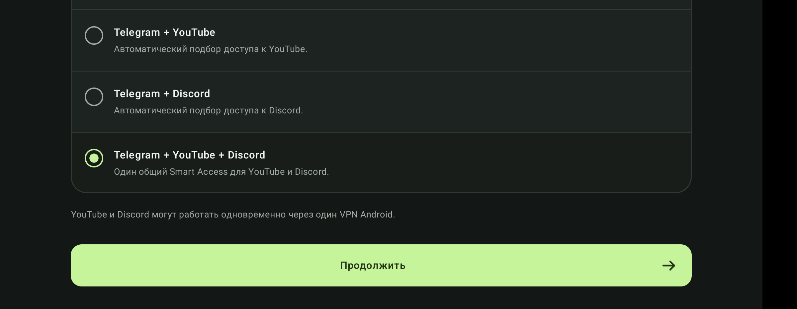

# osh.

### Telegram, YouTube and Discord on Android without babysitting routes and proxy settings.

  

<a href="https://github.com/grudametalla/osh./releases"><strong>Download osh.</strong></a>
&nbsp;&nbsp;·&nbsp;&nbsp;
<a href="README.md">Русский</a>
&nbsp;&nbsp;·&nbsp;&nbsp;
<a href="docs/INSTALL_EN.md">Installation</a>
&nbsp;&nbsp;·&nbsp;&nbsp;
<a href="docs/FEATURES_EN.md">Features</a>

---

## One switch instead of manual routing

osh. keeps the selected services reachable and handles connection routing automatically.

| Telegram | YouTube | Discord |
| :-- | :-- | :-- |
| Local Telegram Bridge | Smart Access | Smart Access |
| Independent from Android VPN | Automatic route selection | Automatic route selection |
| Guided in-app setup | Can run together with Discord | Can run together with YouTube |

**YouTube and Discord can run at the same time through one Android VPN.** Other apps continue to use the normal Internet connection.

## Interface

| Quick setup | Connection check |
| :--: | :--: |
|  |  |
| **Settings** | **YouTube + Discord** |
|  |  |

## What osh. does

- **Automatic mode**: selects a working route for you.
- **Telegram Bridge**: local proxy without manually copying hosts and ports.
- **Smart Access**: dedicated routing for YouTube and Discord.
- **Shared VPN**: YouTube and Discord can use one Android VPNService simultaneously.
- **Recovery**: reconnects after temporary failures and Wi-Fi/LTE changes.
- **Diagnostics**: built-in connection check.
- **Autostart**: restores operation after device reboot.
- **Quick access**: Android Quick Settings tile.
- **Updates**: new builds are installed through the standard Android installer.

## Installation

1. Open [Releases](https://github.com/grudametalla/osh./releases).
2. On most Android phones, download **`osh-<version>-arm64-v8a.apk`**.
3. Install the APK and complete the quick setup.

Minimum version: **Android 8.0**.

> Availability of individual services depends on the current network, carrier and access restrictions.

## Documentation

**[Features](docs/FEATURES_EN.md)** · **[Install & update](docs/INSTALL_EN.md)** · **[Privacy](docs/PRIVACY_EN.md)** · **[Security](docs/SECURITY_EN.md)**

## Support

If something does not work, open an [Issue](https://github.com/grudametalla/osh./issues) and include the osh. version, Android version and network type.

Security reports and suspicious APK guidance are documented in [SECURITY_EN.md](docs/SECURITY_EN.md).

---

Official osh. distribution repository. Proprietary application source code is not published here.

